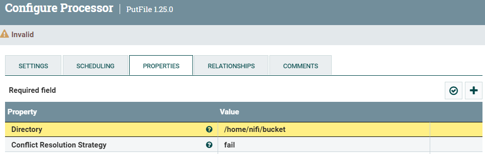
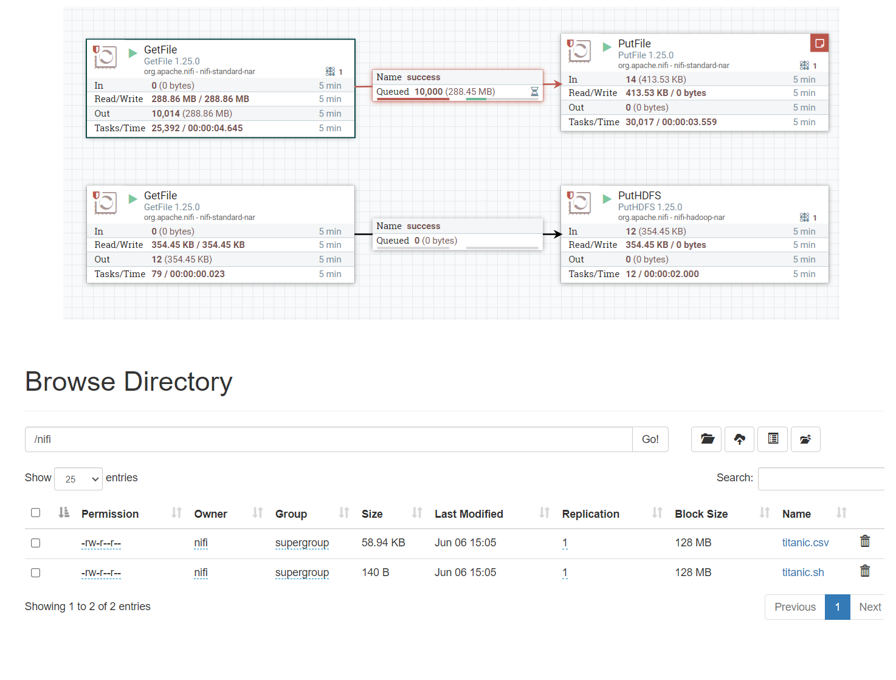
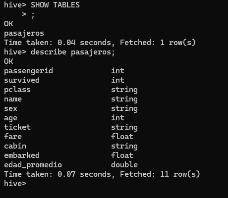
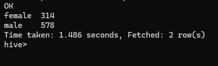
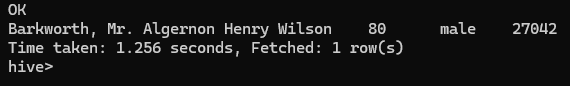

# Practica Nifi


# Ejercicio 1 

En el shell de Nifi, crear un script .sh que descargue el archivo titanic.csv al directorio
/home/nifi/ingest (crearlo si es necesario). Ejecutarlo con ./home/nifi/ingest/ingest.sh.

https://dataengineerpublic.blob.core.windows.net/data-engineer/titanic.csv

### Script titanic.sh
```sh
rm -f /home/nifi/ingest/titanic.csv
wget -P /home/nifi/ingest  https://dataengineerpublic.blob.core.windows.net/data-engineer/titanic.csv
```


# Ejercicio 2 Usando procesos en Nifi:

Veo los permisos: 


### 3) tomar el archivo titanic.csv desde el directorio /home/nifi/ingest.


### 4)  Mover el archivo titanic.csv desde el directorio anterior, a /home/nifi/bucket (crear eldirectorio si es necesario).


### 5) Tomar nuevamente el archivo, ahora desde /home/nifi/bucket.

### 6) Ingestarlo en HDFS/nifi (si es necesario, crear el directorio con hdfs dfs -mkdir /nifi )

    
    


 # Ejercicio 7

  Una vez que tengamos el archivo titanic.csv en HDFS realizar un pipeline en Airflow que
ingeste este archivo y lo cargue en HIVE, teniendo en cuenta las siguientes
transformaciones:

a) Remover las columnas SibSp y Parch.

b) Por cada fila calcular el promedio de edad de los hombres en caso que sea
hombre y promedio de edad de las mujeres en caso que sea mujer.

c) Si el valor de cabina en nulo, dejarlo en 0 (cero)

```sh
>>> df = spark.read.option("header","True").csv("hdfs://172.17.0.2:9000/nifi/titanic.csv")
>>> df.show(3)
+-----------+--------+------+--------------------+------+---+-----+-----+----------------+-------+-----+--------+
|PassengerId|Survived|Pclass|                Name|   Sex|Age|SibSp|Parch|          Ticket|   Fare|Cabin|Embarked|
+-----------+--------+------+--------------------+------+---+-----+-----+----------------+-------+-----+--------+
|          1|       0|     3|Braund, Mr. Owen ...|  male| 22|    1|    0|       A/5 21171|   7.25| null|       S|
|          2|       1|     1|Cumings, Mrs. Joh...|female| 38|    1|    0|        PC 17599|71.2833|  C85|       C|
|          3|       1|     3|Heikkinen, Miss. ...|female| 26|    0|    0|STON/O2. 3101282|  7.925| null|       S|
+-----------+--------+------+--------------------+------+---+-----+-----+----------------+-------+-----+--------+
only showing top 3 rows

>>> df = df.drop('SibSp', 'Parch')
>>> df.show(3)
+-----------+--------+------+--------------------+------+---+----------------+-------+-----+--------+
|PassengerId|Survived|Pclass|                Name|   Sex|Age|          Ticket|   Fare|Cabin|Embarked|
+-----------+--------+------+--------------------+------+---+----------------+-------+-----+--------+
|          1|       0|     3|Braund, Mr. Owen ...|  male| 22|       A/5 21171|   7.25| null|       S|
|          2|       1|     1|Cumings, Mrs. Joh...|female| 38|        PC 17599|71.2833|  C85|       C|
|          3|       1|     3|Heikkinen, Miss. ...|female| 26|STON/O2. 3101282|  7.925| null|       S|
+-----------+--------+------+--------------------+------+---+----------------+-------+-----+--------+
only showing top 3 rows

>>> df.printSchema()
root
 |-- PassengerId: string (nullable = true)
 |-- Survived: string (nullable = true)
 |-- Pclass: string (nullable = true)
 |-- Name: string (nullable = true)
 |-- Sex: string (nullable = true)
 |-- Age: string (nullable = true)
 |-- Ticket: string (nullable = true)
 |-- Fare: string (nullable = true)
 |-- Cabin: string (nullable = true)
 |-- Embarked: string (nullable = true)
>>>

df.createOrReplaceTempView("titanic_view")
new_df = spark.sql("select cast(PassengerId as int), cast(Survived as int), Pclass, Name, Sex, cast(Age as int), Ticket, cast(Fare as float), Cabin, Embarked from titanic_view")

new_df.createOrReplaceTempView("vista_edad")
n_df = spark.sql("select *, avg(Age) over (partition by Sex) as edad_promedio from vista_edad order by PassengerId")

df_final = n_df.fillna({"Cabin": 0 })
df_final.write.mode("overwrite").saveAsTable("titanic.pasajes")

```

## Creamos base de datos y tabla en Hive

```sh

create database Titanic;
```

```sh
CREATE EXTERNAL TABLE titanic.pasajes(Passengerid INT, Survived INT,Pclass STRING, Name STRING, Sex STRING, Age INT, Ticket STRING ,Fare FLOAT, Cabin STRING,Embarked FLOAT, Edad_promedio DOUBLE)
COMMENT 'Pasajes table'
ROW FORMAT DELIMITED
FIELDS TERMINATED BY ','
LOCATION '/tables/external/northwind_analytics/products_sold';
```


# Airflow

DAG titanic.py


```sh

from datetime import timedelta
from airflow import DAG
from airflow.operators.bash import BashOperator
from airflow.operators.dummy import DummyOperator
from airflow.utils.dates import days_ago

args = {
    'owner': 'airflow',
}

with DAG(
    dag_id='Ingest-Hive-Titanic',
    default_args=args,
    schedule_interval='0 0 * * *',
    start_date=days_ago(2),
    dagrun_timeout=timedelta(minutes=60),
    tags=['ingest', 'transform'],
    params={"example_key": "example_value"},
) as dag:

    comienza_proceso = DummyOperator(
        task_id='comenzar_proceso',
    )


    ingest_Hive = BashOperator(
        task_id='ingest_Hive',
        bash_command=' ssh hadoop@172.18.0.8 /usr/bin/sh /home/hadoop/scripts/edades.py ',
    )


    
    finaliza_proceso = DummyOperator(
        task_id='finalizar_proceso',
    )

comienza_proceso >> ingest_Hive  >>  finaliza_proceso


if __name__ == "__main__":
    dag.cli()

```


# Ejercicio 8

 Una vez con la información en el datawarehouse calcular:

a) Cuántos hombres y cuántas mujeres sobrevivieron.

```sql
select sex, count(passengerid) from pasajes  group by sex;

```


b) Cuántas personas sobrevivieron según cada clase (Pclass).
```sql
select pclass , count(passengerid) from pasajes group by pclass;
```


c) Cuál fue la persona de mayor edad que sobrevivió.

```sql
select name, age, sex, ticket from pasajes order by age DESC limit 1;
```


d) Cuál fue la persona más joven que sobrevivió.

```sql
select name, sex, age from pasajes where age is not null order by age limit 10;
```
