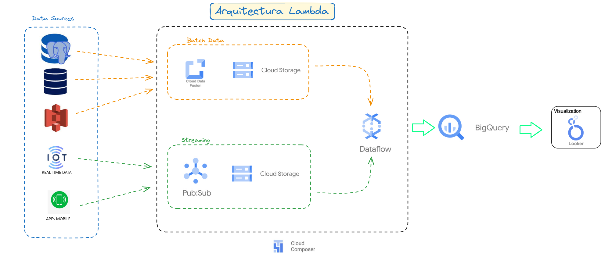

# Ejercicio de arquitectura

Te acaban de contratar en una empresa de la industria minera como Data Engineer/Data Architect para delinear su 
arquitectura y sugerir qué herramientas deberían utilizar para ingestar la data, procesar la información, almacenarla 
en un datawarehouse, orquestar y realizar Dashboards que ayuden a la toma de decisiones basadas en datos.
Luego de realizar algunas reuniones con el team de analitica de la empresa pudimos relevar:

    Sistema ERP: SAP con una base de datos Oracle

    Sistema de Producción: App desarrollada "in house" con una base de datos Postgres.

    Fuentes externas: un proveedor que realiza algunas mediciones de la calidad de las rocas le deja todos sus análisis 
    en un bucket de AWS S3 con archivos Avro.

    Mediciones en tiempo real: Utilizan +100 sensores de mediciones de vibración por toda la mina para detectar 
    movimiento del suelo y se podrían utilizar para predecir posibles derrumbes.

    Apps Mobile: La empresa cuenta con una app mobile donde trackean todos los issues pendientes con maquinaria 
    de la mina.

Desarrollar una arquitectura, que sea escalable, robusta, que sea orquestada automáticamente, que contemple 
seguridad, calidad, linaje del dato, que sea utilizada para procesar tanto información batch como información en 
tiempo real.

-----
----

La Arquitectura elegida para este proyecto es la Lambda:

La arquitectura Lambda proporciona flexibilidad al combinar procesamiento en tiempo real y en batch, permitiendo la corrección de errores y mejoras en la precisión de los datos a lo largo del tiempo.

# Responder las siguientes preguntas:

## 1. Utilizarían infraestructura on premise o en la nube?

Infraestructura en la Nube (GCP):

       -  Ofrece escalabilidad casi ilimitada
       
       -  optimización de costos sin necesidad de grandes inversiones iniciales.

       - Google se encarga del mantenimiento, actualizaciones y parches de seguridad.

       - Acceso a una amplia gama de herramientas y servicios innovadores para análisis de datos, machine learning y big data.

Resumen de la Arquitectura en la Nube (GCP) con Lambda

    Esta arquitectura permite manejar tanto el procesamiento batch como en tiempo real, incluyendo datos de aplicaciones móviles, garantiza la seguridad y calidad de los datos, y es escalable y robusta para soportar las necesidades de una empresa minera en constante crecimiento. La elección de GCP se justifica por la flexibilidad, escalabilidad y conjunto de herramientas avanzadas que ofrece, facilitando el desarrollo e implementación de una solución integral de datos.      

## 2. ETL o ELT? Por qué?

    - Para este proyecto se elige ETL :
    
    ya que con Dataflow permite mantener un pipeline de datos más simplificado y directo, transformando los datos en tránsito y evitando la necesidad de 
    realizar transformaciones posteriores en el data warehouse.

    - Reduce la latencia, ya que los datos llegan transformados y listos para el análisis.

    - La transformación en tránsito evita la necesidad de almacenamiento adicional de datos sin procesar en el data warehouse.

    - Dataflow utiliza un modelo de pago por uso, optimizando costos al procesar y transformar datos solo cuando es necesario.

    - Transformar los datos en tránsito facilita la implementación de políticas de seguridad y gobernanza, asegurando que solo los datos necesarios y en el formato correcto lleguen al data warehouse.

## 3. Que herramienta/s utilizarían para ETL/ELT?

Dataform

## 4. Que herramienta/s utilizarían para Ingestar estos datos?

Google Cloud Data Fusion.

    Ingesta y transformación inicial de datos desde sistemas como SAP (Oracle) y el sistema de producción (Postgres).

Google Cloud Pub/Sub 

    Servicio de mensajería que permite la transmisión y entrega de mensajes en tiempo real.
    Ingesta de datos en tiempo real desde sensores y aplicaciones móviles.
    Alta escalabilidad, baja latencia.

## 5. Que herramienta/s utilizarían para almacenar estos datos?

 Google Cloud Storage

        Almacenamiento temporal de archivos y datos sin procesar desde diversas fuentes externas, como archivos Avro en AWS S3.
        Para almacenar datos en tránsito y datos sin procesar.
        Escalable, duradero, económico, ideal para almacenar datos en bruto.
        Para almacenar datos sin procesar antes de la carga y transformación adicional.

## 6. Como guardarán la información, OLTP o OLAP?

Se guarda en un sistema OLAP:

BigQuery

        Data warehouse escalable y rápido para el análisis y almacenamiento de grandes volúmenes de datos.

## 7 Que herramienta/s utilizarían para Data Governance?

   DAtaPlex     

        Google Cloud Dataplex es una solución integral para la gestión avanzada de datos, que combina gobernanza, seguridad y capacidades analíticas, facilitando a las organizaciones manejar sus datos de manera más eficiente y efectiva.
        

## 8. Data Warehouse, Data Lake o Lake House?

Data Warehouse

### 9. Qué tipo de información gestionarán, estructurada, semi estructurada, no estructurada?

    Estructurada: Datos transaccionales y de producción desde sistemas ERP y bases de datos Postgres.

    Semi-estructurada: Datos de análisis de calidad de rocas en formato Avro.

    No estructurada: Lecturas de sensores en tiempo real y datos de aplicaciones móviles.

### 10. Con que herramienta podrían desplegar toda la infraestructura de datos?

