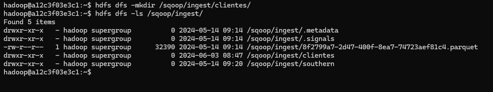
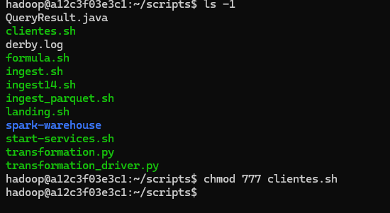
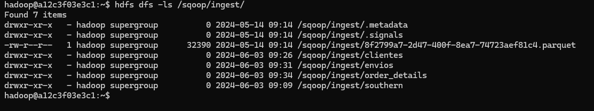
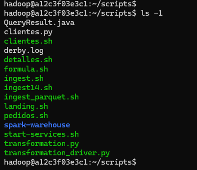
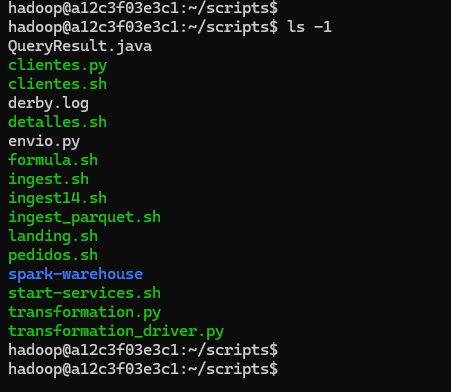

Ejercicios - Sqoop y Airflow
===

Consigna: Por cada ejercicio, escribir el código y agregar una captura de pantalla del resultado
obtenido.


## Ejercicio 1

 Crear una base de datos en Hive llamada northwind_analytics.

    create database northwind_analytics;


## Ejercicio 2


Crear un script para importar un archivo .parquet de la base northwind que contenga la
lista de clientes junto a la cantidad de productos vendidos ordenados de mayor a menor
(campos customer_id, company_name, productos_vendidos). Luego ingestar el archivo
a HDFS (carpeta /sqoop/ingest/clientes). Pasar la password en un archivo.




```sql

SELECT
    cu.customer_id,
    cu.company_name,
    SUM(od.quantity) AS productos_vendidos
FROM
    orders AS o
    INNER JOIN order_details AS od ON o.order_id = od.order_id
    LEFT JOIN customers AS cu ON o.customer_id = cu.customer_id
GROUP BY
    cu.customer_id,
    cu.company_name
ORDER BY
        productos_vendidos DESC;

```
### Scripts clientes.sh

```sh
# Remove old Northwind Analytics files in HDFS
/home/hadoop/hadoop/bin/hdfs dfs -rm -r /sqoop/ingest/clientes/*


sqoop import \
--connect jdbc:postgresql://172.17.0.3:5432/northwind \
--username postgres \
----P \
--query 'SELECT cu.customer_id, cu.company_name, SUM(od.quantity) AS productos_vendidos FROM orders AS o INNER JOIN order_details AS od ON o.order_id = od.order_id LEFT JOIN customers AS cu ON o.customer_id = cu.customer_id WHERE $CONDITIONS GROUP BY cu.customer_id, cu.company_name ORDER BY productos_vendidos DESC' \
--m 1 \
--target-dir /sqoop/ingest/clientes \
--as-parquetfile \
--delete-target-dir
```

ubicacion : 




## Ejercicio 3

Crear un script para importar un archivo .parquet de la base northwind que contenga la
lista de órdenes junto a qué empresa realizó cada pedido (campos order_id,
shipped_date, company_name, phone). Luego ingestar el archivo a HDFS (carpeta
/sqoop/ingest/envíos). Pasar la password en un archivo.



```sql
select
    o.order_id,
    cast(o.shipped_date as varchar),
    c.company_name,
    c.phone
from
    orders o
    left join customers c on o.customer_id = c.customer_id;
```  
### Script pedidos.sh

```sh
# Remove old Northwind Analytics files in HDFS
/home/hadoop/hadoop/bin/hdfs dfs -rm -r /sqoop/ingest/envios/*

# Download Clientes from Northwind DB
/usr/lib/sqoop/bin/sqoop import \

--connect jdbc:postgresql://172.17.0.3:5432/northwind \
--username postgres \
--P \
--query "select o.order_id, cast(o.shipped_date as varchar), c.company_name, c.phone from orders o left join customers c on o.customer_id = c.customer_id where \$CONDITIONS" \
--m 1 \
--target-dir /sqoop/ingest/envios \
--as-parquetfile \
--delete-target-dir
```


## Ejercicio 4

 Crear un script para importar un archivo .parquet de la base northwind que contenga la
lista de detalles de órdenes (campos order_id, unit_price, quantity, discount). Luego
ingestar el archivo a HDFS (carpeta /sqoop/ingest/order_details). Pasar la password en
un archivo.

```sql
select
    od.order_id,
    od.unit_price,
    od.quantity,
    od.discount
from
    order_details od;
```

### Script detalles.sh
```sh
# Remove old Northwind Analytics files in HDFS

/home/hadoop/hadoop/bin/hdfs dfs -rm -r /sqoop/ingest/order_details/*

sqoop import \
--connect jdbc:postgresql://172.17.0.3:5432/northwind \
--username postgres \
--P \
--query "select od.order_id, od.unit_price, od.quantity, od.discount from order_details od where \$CONDITIONS" \
--m 1 \
--target-dir /sqoop/ingest/order_details \
--as-parquetfile \
--delete-target-dir

```


## Ejercicio 5

Generar un archivo .py que permita mediante Spark insertar en hive en la db
northwind_analytics en la tabla products_sold, los datos del punto 2, pero solamente
aquellas compañías en las que la cantidad de productos vendidos fue mayor al
promedio.

### se crea la tabla en Hive
```sh
CREATE EXTERNAL TABLE northwind_analytics.products_sold(customer_id STRING, company_name STRING, productos_vendidos INTEGER)
COMMENT 'Northwind Analytics Products Sold table'
ROW FORMAT DELIMITED
FIELDS TERMINATED BY ','
LOCATION '/tables/external/northwind_analytics/products_sold';
```

### Archivo clientes.py

```sh
from pyspark.context import SparkContext
from pyspark.sql.session import SparkSession
from pyspark.sql import HiveContext
sc = SparkContext('local')
spark = SparkSession(sc)
hc = HiveContext(sc)

df = spark.read.option("header", "true").parquet("hdfs://172.17.0.2:9000/sqoop/ingest/clientes")

df.createOrReplaceTempView("view_clientes")

new_df = spark.sql("select customer_id, company_name, cast(productos_vendidos as int) from view_clientes ")

new_df.createOrReplaceTempView("view_final")

spark.sql("insert into northwind_analytics.products_sold select * from view_final")
```




## Ejercicio 6

Generar un archivo .py que permita mediante Spark insertar en hive en la tabla
products_sent, los datos del punto 3 y 4, de manera tal que se vean las columnas
order_id, shipped_date, company_name, phone, unit_price_discount (unit_price with
discount), quantity, total_price (unit_price_discount * quantity). Solo de aquellos pedidos
que hayan tenido descuento.

 ### Genero tabla en Hive

```sh
CREATE EXTERNAL TABLE northwind_analytics.products_sent(order_id INTEGER, shipped_date DATE, company_name STRING, phone STRING, unit_price_discount DOUBLE, quantity INTEGER, total_price DOUBLE)
COMMENT 'Northwind Analytics Products Sent table'
ROW FORMAT DELIMITED
FIELDS TERMINATED BY ','
LOCATION '/tables/external/northwind_analytics/products_sent';;
```

### Genero Archivo envio.py

```sh
from pyspark.context import SparkContext
from pyspark.sql.session import SparkSession
from pyspark.sql import HiveContext
sc = SparkContext('local')
spark = SparkSession(sc)
hc = HiveContext(sc)

df = spark.read.option("header", "true").parquet("hdfs://172.17.0.2:9000/sqoop/ingest/order_details")

df.createOrReplaceTempView("view_order")

new_df = spark.sql("select order_id, cast(unit_price as double), quantity, cast(discount as double) from view_order")


df1 = spark.read.option("header", "true").parquet("hdfs://172.17.0.2:9000/sqoop/ingest/envios")
df1.createOrReplaceTempView("view_envios")


new_df1 = spark.sql("select order_id, cast(shipped_date as date), company_name, phone  from view_envios")


df_final = new_df1.join(new_df, on="order_id", how="inner")

df_final.createOrReplaceTempView("view_final")

spark.sql("insert into northwind_analytics.products_sent select* from view_final")
```




## DAG 

```

from airflow import DAG
from airflow.operators.bash import BashOperator
from airflow.operators.dummy import DummyOperator
from airflow.utils.task_group import TaskGroup
# from airflow.utils.dates import days_ago

from datetime import datetime, timedelta


args = {
    'owner': 'airflow',
}


with DAG(
    dag_id='Ejercicio_clase_9',
    default_args=args,
    schedule_interval='@daily',
    start_date=datetime(2023, 1, 1),
    dagrun_timeout=timedelta(minutes=60),
    tags=['edvai', 'airflow'],
    params={'example_key': 'example_value'},
) as dag:
    comienza_proceso = DummyOperator(
        task_id='comienza_proceso',
    )

    with TaskGroup(group_id="Ingest") as Ingest:        
        extract_table_1 = BashOperator(
            task_id='extract_table_1',
            bash_command='/usr/bin/sh /home/hadoop/scripts/clientes.sh ',
        )

        extract_table_2 = BashOperator(
            task_id='extract_table_2',
            bash_command='/usr/bin/sh /home/hadoop/scripts/pedidos.sh ',
        )

        extract_table_3 = BashOperator(
            task_id='extract_table_3',
            bash_command='/usr/bin/sh /home/hadoop/scripts/detalles.sh ',
        )
        
    with TaskGroup('Process') as Process:
        processing_table_1 = BashOperator(
            task_id='processing_table_1',
            bash_command='ssh hadoop@172.17.0.2 /home/hadoop/spark/bin/spark-submit --files /home/hadoop/hive/conf/hive-site.xml /home/hadoop/scripts/clientes.py',
        )

        processing_table_2_3 = BashOperator(
            task_id='processing_table_2_3',
            bash_command='ssh hadoop@172.17.0.2 /home/hadoop/spark/bin/spark-submit --files /home/hadoop/hive/conf/hive-site.xml /home/hadoop/scripts//envio.py',
        )

    finaliza_proceso = DummyOperator(
        task_id='finaliza_proceso',
    )

    comienza_proceso >> Ingest >> Process >> finaliza_proceso


if __name__ == "__main__":
    dag.cli

 ```  