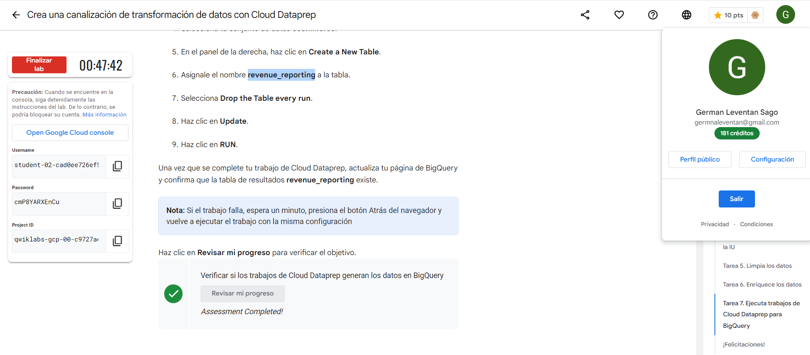
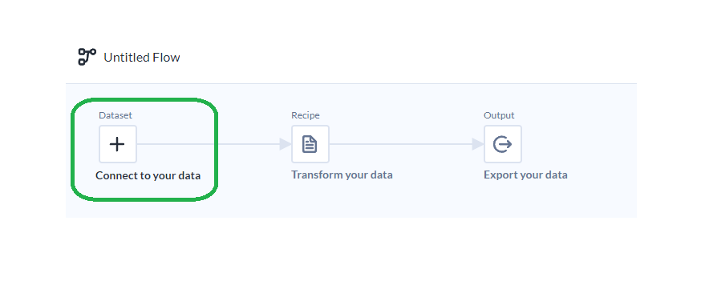
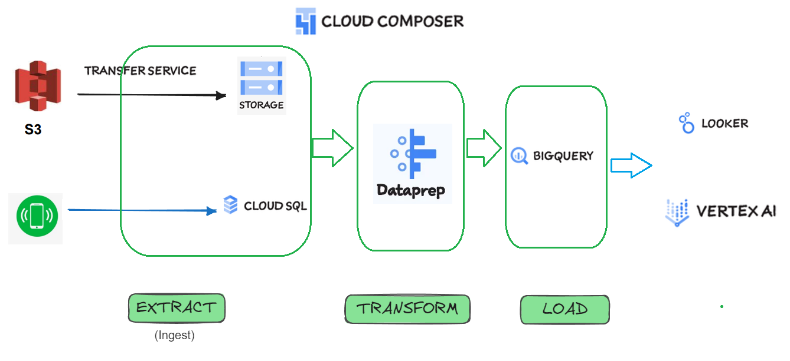

# Google Skills Boost - Examen Fina

## LAB:

Realizar el siguiente LAB, al finalizar pegar un print screen donde se ve su perfil y el progreso
final verificado.

Título: Creating a Data Transformation Pipeline with Cloud Dataprep.

Schedule: 1 hour 15 minutes

Cost: 5 Credits
Link:

https://www.cloudskillsboost.google/focuses/4415?catalog_rank=%7B%22rank%22%3A1%2C%22num_filters%22%3A0%2C%22has_search%22%3Atrue%7D&parent=catalog&search_id=32278924

# Contestar las siguientes preguntas:

##  1. ¿Para que se utiliza data prep?

    Dataprep es la herramienta de preparación de datos de autoservicio de Google creada en colaboración con Alteryx,
    te permite realizar diversas tareas para transformar tus datos en un formato listo para análisis, informes y aprendizaje automático.

## 2. ¿Qué cosas se pueden realizar con DataPrep?

    - Conexión a diversas fuentes de datos.
    - Exploración y limpieza de datos.
    - Enriquecimiento de datos.
    - Transformación de datos.
    - Visualización de datos.
    - Colaboración en tiempo real.
    - Automatización de flujos de trabajo.
    - Integración con otras herramientas de análisis.

## 3. ¿Por qué otra/s herramientas lo podrías reemplazar? Por qué?
    • Snowflake es una plataforma de almacenamiento y análisis de datos basada en la nube. Fue diseñada para gestionar grandes volúmenes de datos y permitir análisis rápidos y eficientes.
    Snowflake en sí mismo no es una herramienta de visualización, se integrar muy bien con diversas herramientas de ETL (Extract, Transform, Load) y plataformas de visualización de datos.

    • Databricks es una plataforma de análisis de datos basada en la nube que se centra en el procesamiento y análisis de grandes volúmenes de datos. Es conocida por su integración y optimización de Apache Spark, un motor de análisis en tiempo real y por lotes muy popular

## 4. ¿Cuáles son los casos de uso comunes de Data Prep de GCP?
explorar, limpiar y preparar de datos, osea, la preparacion de datos.

## 5. ¿Cómo se cargan los datos en Data Prep de GCP?

Se accede a data Prep, se crea un nuevo Flow (create Flow) y se hace clic en Connect to your data.

## 6. ¿Qué tipos de datos se pueden preparar en Data Prep de GCP?

Archivos csv, Excel, json, avro, parquet, orc, base de datos.

## 7. ¿Qué pasos se pueden seguir para limpiar y transformar datos en Data Prep de GCP?

Despues de obtener los datos, se continua con el flow creado( punto 5).

## 8. ¿Cómo se pueden automatizar tareas de preparación de datos en Data Prep de GCP?

primero se necesita crear un flujo de trabajo (flow) que defina cómo se deben preparar y transformar los datos.
Despues Dataprep permite programar ejecuciones automáticas de flujos de trabajo en intervalos regulares:
    elecciona el flow que deseas programar
    clic en el botón Run y luego en Schedule.
    Configura los detalles de la programación, como la frecuencia (diaria, semanal, etc.) y la hora de inicio.
    Confirma y guarda la programación.
Para automatizar tareas basadas en eventos (por ejemplo, cuando se sube un nuevo archivo a GCS), puedes usar Google Cloud Functions o Cloud Composer (Apache Airflow).

## 9. ¿Qué tipos de visualizaciones se pueden crear en Data Prep de GCP?

## 10. ¿Cómo se puede garantizar la calidad de los datos en Data Prep de GCP?

## Arquitectura:

El gerente de Analitca te pide realizar una arquitectura hecha en GCP que contemple el uso de esta herramienta ya que le parece muy fácil de usar y una interfaz visual que ayuda a sus
desarrolladores ya que no necesitan conocer ningún lenguaje de desarrollo.
Esta arquitectura debería contemplar las siguiente etapas:

- Ingesta: datos parquet almacenados en un bucket de S3 y datos de una aplicación que guarda sus datos en Cloud SQL.

- Procesamiento: filtrar, limpiar y procesar datos provenientes de estas fuentes
Almacenar: almacenar los datos procesados en BigQuery.

- BI: herramientas para visualizar la información almacenada en el Data Warehouse.

- ML: Herramienta para construir un modelo de regresión lineal con la información almacenada
en el Data Warehouse.

